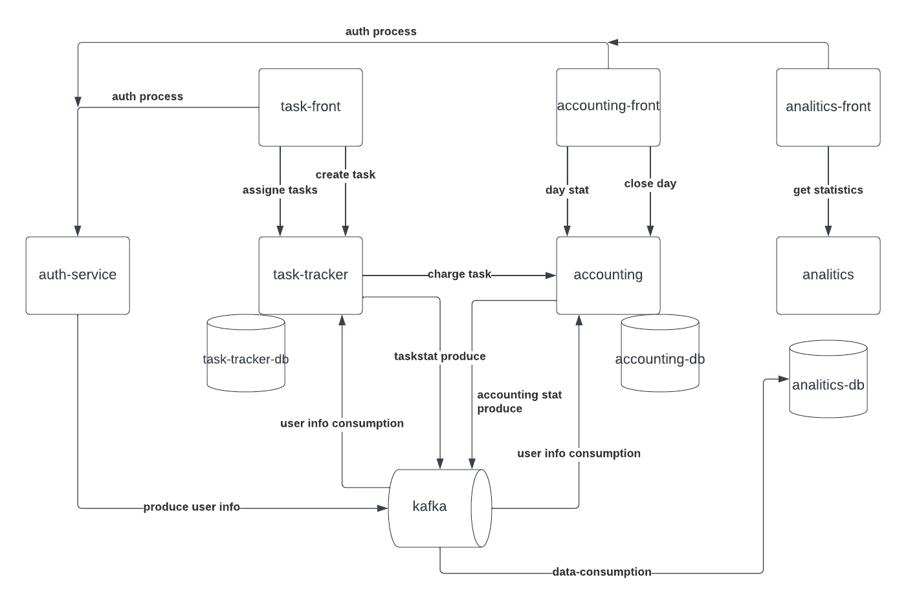

# async_arch
# Данный проект сделан для углубленного изученного асинхронного взаимодействия микросервисов в рамках курса https://education.borshev.com/architecture
# в данном проекте упор сделан на взаимодействии между сервисами, качество кода самих сервисов сознательно поставлено на второй и третий план
## Awesome Task Exchange System aka (aTES) UberPopug Inc

## Общее описание архитектуры



Верхнеуровнево проект состоит из четырёх основных сервисов:
- сервиса авторизации/регистрации пользователей (auth-service)
- сервиса работы с задачами (task-tracker)
- сервиса работы со счетами пользователей (accounting)
- сервиса аналитики (analytics)

### Сервис task-tracker
- даёт возможность создавать задачи 
- даёт возможность рандмомно переасайнить все задачи на рандмоных пользователей
- показывает пользователю список заасайненых на него задач
- даёт возможность пользователю отметить задачу выполненной
- списывает/начисляет деньги за задачу через сервис accounting
- потребляет информацию о пользовательских ролях из кафки сервиса auth-service
- поставляет информацию в аналитический топик кафки  

#### Краткое описание api
``` 
// запрос на создание задачи
CreateTaskRequest {
    descritption // описание задачи
}

// запрос на реасайн всех текущих задач
ReasigneTasksRequest {
    user_id // id пользователя вызвашего реафсайн всех задач
}
```

#### Взаимодействие с сервисом accounting
Взаимодействие с сервисом accounting можно построить несколькими способами
- синхронно через вызов api сервиса  
- асинхронно через публикацию события в топик кафки/аутбокс таблицу в БД сервиса и дальнейший вызов api  
при

**при синхронном взаимодействии**   
- при недоступности сервиса accounting получчаем полную недоступность методов завершения и реасайна задач, т.к не можем синхронно изменить баланс.  

**при асинхронном взаимодействие**  
- необходимо строго следить за порядком списания/начилсения средств для того чтобы не получить расходжение в балансах
- можем получить значительную задержку отображения изменений баланса баланса при большом лаге сообщений в топике кафки
- можем некорректно закрывать дни и формировать выплаты пользователю на конец дня, т.к изменений балансо относящихся к текущему дню могут застрять в топике кафки из за лага

#### Взаимодействие с сервисом analitics
Взаимодействие с сервисом analitics строится через публикацию событий во внутренний аутбокс, а оттуда воркером поставляем сообщения в кафку, здесь мы не боимся лага и запаздывания консюмера, т.к нет требований к отображению аналитики в реальном времени.

### Сервис accoutning
- хранит балансы пользователей
- хранит аудитлог изменений балансов
- выводит статистику зарабтанных компанией денег за день
- выполняет процедуру закрытия дня (считает сколько денег заработал каждый пользователь, отправляет чеки на почту, обнуляет положительный баланс, отрицательный переносит на следующий день)
- поставляет аудитлог изменений балансов в аналитическую кафку
- потребляет информацию о новых пользователях из кафки сервиса auth-service, при получении события о регистрации нового пользователя создаёт пользовательский счёт

#### Краткое описание api
```
// запрос на изменение баланса
ChargeReqeust {
    ChargeType charge_type // тип изменения баланса
    task_id // id задачи по результатам которой изменям баланс
    user_id // id пользователя которому изменяем баланс
    idempotency_key // ключ идемпотентности при изменении баланса
}

// типы изменений баланса
ChargeType enum {
    Credit // увеличиваем баланс при выполнении задачи
    Debit // уменьшаем баланс при асайне задачи
}
```

#### Взаимодействие с сервисом analitics
Взаимодействие с сервисом analitics строится через публикацию событий во внутренний аутбокс, а оттуда воркером поставляем сообщения в кафку, здесь мы не боимся лага и запаздывания консюмера, т.к нет требований к отображению аналитики в реальном времени

### Сервис analitics
- хранит события происходившие в других сервисах (ассайн задач, списание денег за задачу, etc)
- строит витрины данных и дашборды (покзаать самую дорогую задачу, etc)
- доступен только пользователям с ролью администратора
- потребляет данные из топиков кафки
- возможно стоит использовать кликхаус в качестве хранилища данных, т.к кликхаус умеет потреблять данные из кафки напрямую при помощи адаптеров

#### Краткое описание api
```
// запрос на получение самой дорогой задачи за период
ExpensiveTaskRequest {
    from_date // нижняя граница периода
    end_date // верхняя граница периода, если не указана верхняя граница периода будет возвращаена самая дорогая задача за from_date
    user_role // роль пользователя, получается фронтом при авторизации пользователя через сервис auth-service
}
```
